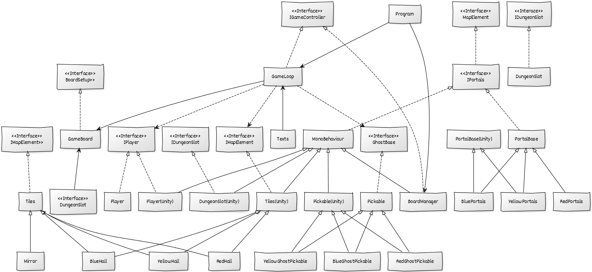

# LP2 Exam project: 18 ghosts for console and unity

## Author:

**Diana Levay** - a21801515 [nanilevay](https://github.com/nanilevay)

### Task list
  Everything in the project was done by the student using the references 
specified below.
  
### Project's Git Repository:

<https://github.com/nanilevay/18ghosts_lp2_exam>

### Solution Architecture:

## Solution Description:

The first solution was going to be implemented on the console and then adapted 
to unity, however after studying the MVC pattern and seeing tutorials, it was 
changed so that the unity version was the "base" to create the model for both. 
Thus, the project is organised in the following way:

Each component in the map consists of a `Tile`, that implements the 
`IMapElement` interface in order to get a position, colour and way to be
 represented in the game, each tile can be empty or occupied, and they are 
aware of the kind of piece inside them by comparing their own colour to the 
piece the player has placed.

There's three regular tiles, blue yellow and red, and these restrict whether 
the player can place a ghost inside them if they're inside the Dungeon or at 
the beginning of the game.

There's 4 mirror at specific positions, and these check the piece's
 `"OnMirror" ` `bool` in order to restrict the movemet.

There's also 3 portals, one of each colour, that will receive a `"GhostDied" 
bool` and enter the `Rotate()` method in order to check which ghost died and 
rotate accordingly. These portals also have an `"AdjacentTileCheck"` where 
they check the tiles adjacent to themselves and let a ghost out if they're 
facing a certain tile with a ghost matching its colour;

Each ghost piece implements the `IGhostBase` interface in order to know what 
colour it is and how to represent it, as well as if the piece is currently in 
the dungeon or on a mirror, in order to act accordingly to those rules.

There was effort to implement the MVC pattern in order to share the model 
along the unity and console versions of the game, as well as the Template 
pattern, where a base class with abstract methods was overwritten by its
 inherited members according to need, though this wasn't fully accomplished
 due to time restraints, the model of the game remains independent from both
 implementations, and each class implements an interface in order to follow 
this model.

The players implement the `IPlayer` interface and during the loop there's a 
rotation between player A and player B done by having a third instance of a 
player, the `CurrentPlayer` that stores the current play being made by each 
and then is equated to the other in each play.

The  board is setup so that in the unity version, each tile is defined inside
 the common array and then each object is instanciated where it's due, whereas
 in the console version a tile of each type is printed on the map for the 
checking, and both implement `IBoardBase`.

The gameloop pattern was used for the console version, seeing as unity already
 implements it by default, and there was focus on trying to make the classes 
depend on eachother as little as possible, altough at times this had to be 
scratched due to time constraints. Each GameLoop class for each version
 implements the `IGameController` interface.

The text to be displayed on the game follows a Singleton pattern, in order to
 be initialised once and used through both implementations, and is present in 
the `Texts` class.

On both implementations, the sub-classes implement a base class that's either
 for unity or the console version, but the sub-classes themselves fit as part
 of the model as they are the exact same (E.g `YellowGhostPickable`, 
identical for both versions, extends from `Pickable`,which implements the 
`IGhostBase` interface (also identical for both) and is different for each
 version).

Due to time constraints, the loop in the console version sometimes shows some 
bugs at some points that couldn't be fully fixed in time for delivery, but 
the game is functional when the input is correct.

Due to time constraints, the branch "newBoard" was set as the master branch
in github as to not delay the delivery of the project due to merge conflicts.

### UML Diagram

This diagram shows the main class structure found in the programs as well as 
the relations between classes and interfaces used.

## References

Referenced the 
[first lp2 projects](https://github.com/nanilevay/lp2_project1), 
for the document structure following the same report logic done by the 
student and others in the past, as well as how to  do the doxygen by student 
**[ana dos santos - a21801515](https://github.com/AnSantos99)**

For the UML:

https://yuml.me/

For the general logic of the game, the presentation slides from the LPII class 
resources were also used.

The .NET API as well as the UNITY API were constantly referenced as well, in
 order to make sure everything was working accordingly.

For the MVC pattern:

<https://www.toptal.com/unity-unity3d/unity-with-mvc-how-to-level-up-your-game-development>

https://riptutorial.com/unity3d/example/32513/model-view-controller--mvc--design-pattern

https://blog.codinghorror.com/understanding-model-view-controller/

For the initial map logic:

<https://learn.unity.com/tutorial/level-generation?projectId=5c514a00edbc2a0020694718#5c7f8528edbc2a002053b6f6>

For the button handling:

<https://www.youtube.com/watch?v=-xB4xEmGtCY>

